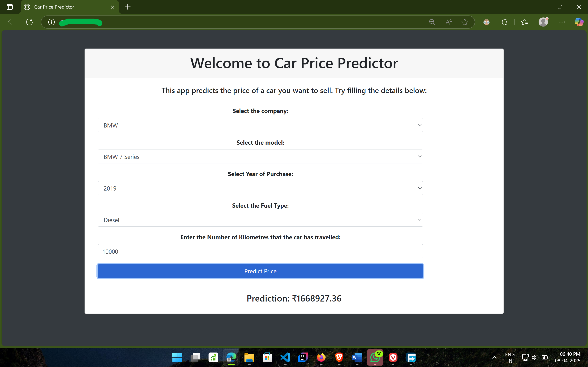

# 🚘 Car Value Predictor – AI-Powered Car Price Estimator

**An AI-powered web application that predicts the resale value of a car based on specifications like brand, model, fuel type, kilometers driven, and manufacturing year — styled with a high-end Apple-like aesthetic.**



---

## ✨ Features 

- 🔮 **Accurate Price Predictions** using a trained Linear Regression model on cleaned car resale data.
- ⚡️ **Real-time dynamic form**: Model list updates automatically when the company is selected.
- 🍎 **macOS/Apple-style UI**: Minimal, glassmorphic design with smooth Spotlight-style animation on prediction reveal.
- 📊 **Machine Learning Backend**: Trained on real-world car resale data for smart valuation.
- 🔥 Responsive layout built with Bootstrap 4, custom CSS, and JS interactivity.
- 🔄 Extensible architecture — easily swappable model or frontend for upgrades.

---

## 🧠 Tech Stack

| Tech               | Role                                 |
| ------------------ | ------------------------------------ |
| **Flask**          | Backend Web Framework (Python)       |
| **HTML/CSS/JS**    | Frontend Template                    |
| **Bootstrap 4**    | Responsive Design                    |
| **Jinja2**         | Templating engine for dynamic UI     |
| **Pandas & NumPy** | Data processing                      |
| **scikit-learn**   | Machine Learning (Linear Regression) |
| **Pickle**         | Model serialization                  |

---

## 📸 Demo Preview


---

## 🚀 Getting Started

### 1. Clone the Repo

```bash
git clone https://github.com/your-username/car-value-predictor.git
cd car-value-predictor
```

### 2. Create a Virtual Environment

```bash
python -m venv .venv
.\.venv\Scriptsctivate  # Windows
# source .venv/bin/activate  # macOS/Linux
```

### 3. Install Dependencies

```bash
pip install -r requirements.txt
```

> Make sure `requirements.txt` includes:

```text
Flask
pandas
numpy
scikit-learn
flask-cors
```

### 4. Run the Flask App

```bash
python applications.py
```

### 5. Open the App

Go to `http://127.0.0.1:5000` in your browser.

---

## 🧪 Model Training

To retrain the model:

- Use `pricecar.ipynb`
- Train on `Cleaned Car.csv`
- Save model using:

```python
pickle.dump(model, open('LinearRegressionModel.pkl', 'wb'))
```

---

## 📂 Project Structure

```
📁 Car_Price
├── applications.py
├── templates/
│   └── index.html
├── static/
│   ├── css/style.css
│   └── images/
├── Cleaned Car.csv
├── LinearRegressionModel.pkl
├── pricecar.ipynb
└── requirements.txt
```

---
